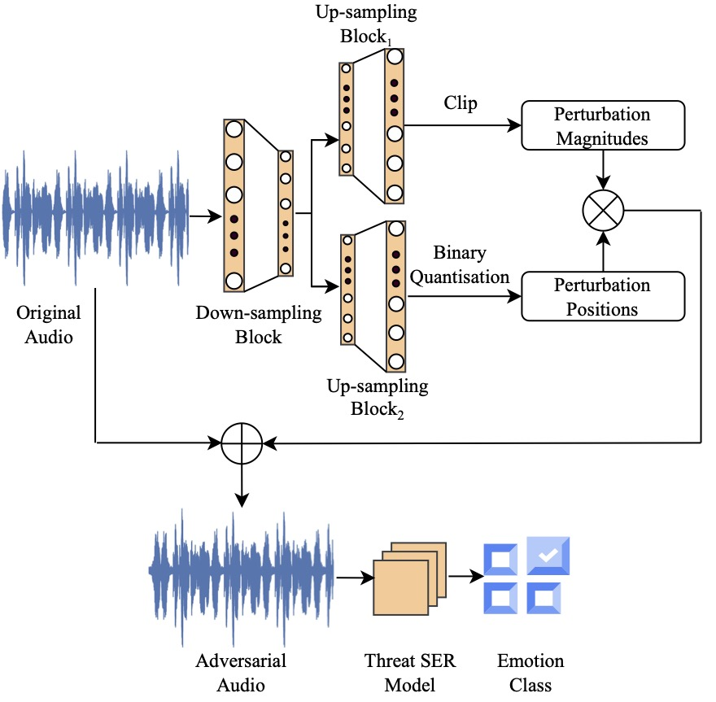

# STAA-Net: A Sparse and Transferable Adversarial Attack for Speech Emotion Recognition
[](https://arxiv.org/abs/2402.01227)
[](https://opensource.org/licenses/MIT)



This is a Python and PyTorch code for the prototype learning framework in our paper: 

<!--[Prototype learning for interpretable respiratory sound analysis].-->

>Yi Chang, Zhao Ren, Zixing Zhang, Xin Jing, Kun Qian, Xi Shao, Bin Hu, Tanja Schultz, and Björn W. Schuller. STAA-Net: A Sparse and Transferable Adversarial Attack for Speech Emotion Recognition. Submitted to IEEE Transactions on Affective Computing.

## Citation

```
@misc{chang2024staanetsparsetransferableadversarial,
      title={STAA-Net: A Sparse and Transferable Adversarial Attack for Speech Emotion Recognition}, 
      author={Yi Chang and Zhao Ren and Zixing Zhang and Xin Jing and Kun Qian and Xi Shao and Bin Hu and Tanja Schultz and Björn W. Schuller},
      year={2024},
      eprint={2402.01227},
      archivePrefix={arXiv},
      primaryClass={cs.SD},
      url={https://arxiv.org/abs/2402.01227}, 
}
```

## Abstract

Speech contains rich information on the emotions of humans, and Speech Emotion Recognition (SER) has been an important topic in the area of human-computer interaction. The robustness of SER models is crucial, particularly in privacy-sensitive and reliability-demanding domains like private healthcare. Recently, the vulnerability of deep neural networks in the audio domain to adversarial attacks has become a popular area of research.
However, prior works on adversarial attacks in the audio domain primarily rely on iterative gradient-based techniques, which are time-consuming and prone to overfitting the specific threat model. Furthermore, the exploration of sparse perturbations, which have the potential for better stealthiness, remains limited in the audio domain. To address these challenges, we propose a generator-based attack method to generate sparse and transferable adversarial examples to deceive SER models in an end-to-end and efficient manner. We evaluate our method on two widely-used SER datasets, Database of Elicited Mood in Speech (DEMoS) and Interactive Emotional dyadic MOtion CAPture (IEMOCAP), and demonstrate its ability to generate successful sparse adversarial examples in an efficient manner.
Moreover, our generated adversarial examples exhibit model-agnostic transferability, enabling effective adversarial attacks on advanced victim models.

## Dataset Preperation
Generate the h5 file, with “train_audio”, “train_y”, “dev_audio”, “dev_y”, “test _audio”, “test_y”:

```
data_h5_gen.py
```

## SER Models Preparation
Fine-tune pre-trained foundation models (wav2vec 2.0 and WavLM) and develop the train-from-scratch models (Emo18 and Zhao19):
```
ser_models_train.py
```

## Baseline Adversarial Attackers

For baselines (PGD, SparseFool, One-Pixel), use source threat models to generate the adversarial examples and store them in hdf5 file:
```
baselines_attack_train.py
```
With the generated adversarial examples by baselines, attack the target victim models:
```
baselines_attack_eval.py
```

## STAA-Net attacker
Train the generator to craft and save the adversarial examples:
```
generator_train.py
```
With the STAA-Net generated adversarial examples, attack the target victim models:
```
generator_eval.py
```


